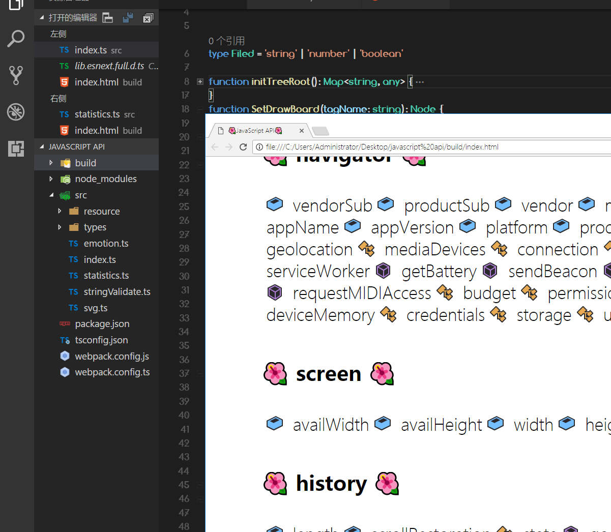

# 🦄javascript-api🦄
项目功能正在持续更新, 欢迎大家学习探讨
 

# 🏆技术点🏆
TypeScript
React 16.2 
React-Router 4.x
antd 3.x
国际化语言
Redux

# 🚀启动项目 🚀

命令行键入如下指令,启动项目
npm run dev  

# ⚡️note⚡️
1 ,如果命令行在生成的时候服务器卡住,可以用键盘按下任意键,命令行可以获得焦点继续编译 

# 🌌项目截图🌌

# 第一版🐷

# 第二版🐷🐷
